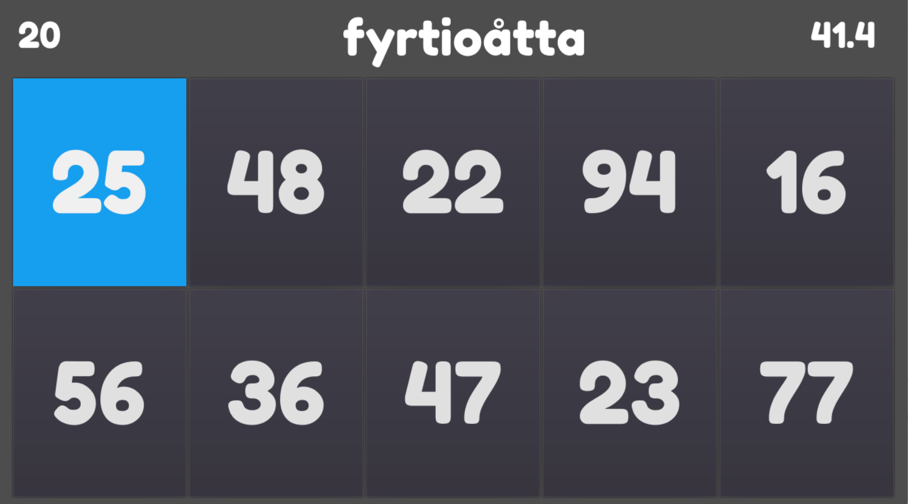

# NumberWall

NumberWall is a game to aid learning numbers in various languages. The player is shown the text for a number 0-100 in their target language and then ten options as to the number it could represent. The aim is to get as many right in one minute as possible. The game retains high scores (only locally on the device) so each time you play you can see if you did better than last time.

If you are unsure as to the answer, the game will help you after ten seconds by removing five of the options and a further three options after another three seconds. 

The game runs entirely locally on your device, no log in account is needed, no data is saved in the cloud. 

Pre built binaries of this game will be available from https://liamgh.itch.io/numberwall and the Android Play Store.

## Supported Languages
The game currently supports learning numbers in:
- Danish
- English
- French
- German
- Irish
- Jèrriais
- Manx
- Norweigian
- Spanish
- Swedish
- Welsh

## Errors, Additions, Problems?
If you notice any errors or issues then please report the issue at:
https://github.com/liamgh/NumberWall

If you would like to add a language to the game then please file an issue and attach the following:
- A text file with each number from 0-100 written out
- A link to at least one website page about the language to verify the translations and provide further information
- The name of the language in English 

The request can then be reviewed and a decision taken on whether to include the change.

Alternatively, the project can be forked and adapted as you wish.

## Credits
This game was written by Liam Green-Hughes as a way to learn more about the wonderful [Godot Engine](https://godotengine.org/).

The font is [Fredoka One](https://fonts.google.com/specimen/Fredoka+One/about), used under the Open Font Licence.

The sound effects come from the [Kenney UI Sounds](https://kenney.nl/assets/ui-audio) pack and are used under CC-0.
